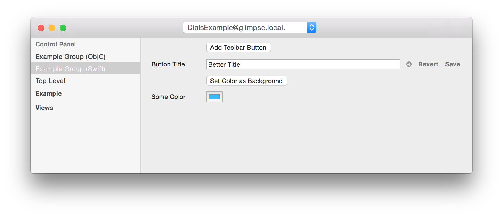

The Control Panel plugin lets you create screens of controls on the Desktop that will modify values in your running iOS app. It will also save changes to a value back to your code if you press the save button attached to that control.

Here is an example control panel:


To create a control, you need to declare it in your code. The DialsExample project that is part of the Dials distribution has a number of [Objective-C examples](../DialsExample/Source/ViewController.m) and [Swift examples](../DialsExample/Source/ViewController.m).

To declare a control you can simply call the ``DLSControl`` function. This will create a control in the desktop app that will automatically go away when the calling object gets deallocated. Here's an example that creates a new Slider.

Objective-C:
```
NSColor* aColor = [UIColor blackColor];

...

DLSControl(@"My Color").colorOf(&aColor);
```

Swift:
```
var aColor = UIColor.blackColor()

...

DLSControl("My Color").colorOf(&aColor);

```

When your code gets called your control will show up under the Control Panel tab in the Dials desktop app. You can create groups of controls using ``DLSControlGroupWithName``. That will nest any controls created in the associated block together in a tab within the desktop app with the given name. If no group is currently specified, controls will appear under the "Top Level" item listed with Control Panel.


There is also a variant of ``DLSControl`` that works with Key-Value coding compliant keypaths.

Objective-C:
```
DLSControlForKeyPath("someProperty").asColor();
```

Swift:
```
DLSControl("someProperty").asColor()
```

There is a full list of editors in [``DLSControlPanelPlugin.h``](../iOS/Source/DLSControlPanelPlugin.h).

